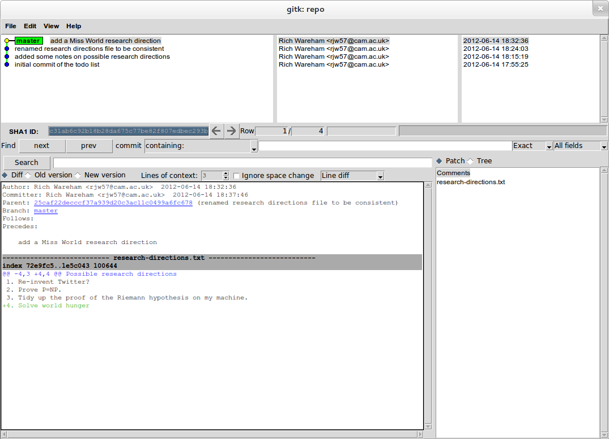
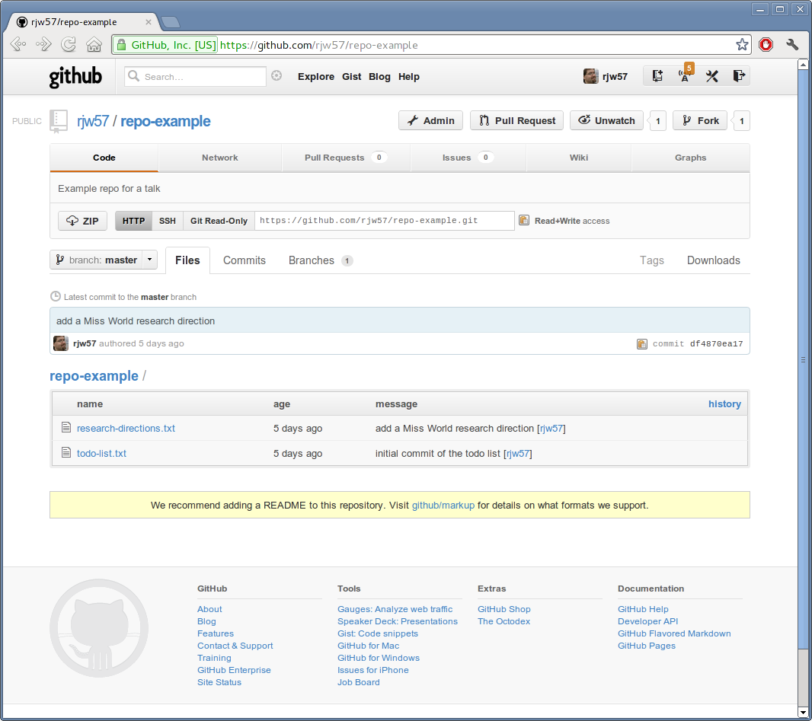

Introduction to Git
===================

This talk is aimed at the working researcher in the Engineering Department. You may not realise it, but you are a
software engineer. If you write stuff in MATLAB or Python, you're a software engineer. If you maintain non-trivial LaTeX
documents you're a software engineer. Even if you are curating processed data you're a software engineer. I'm using an
admittedly broad definition of 'software' but I'm going to declare that any iteratively improved input prepared for
consumption by a computer which cannot be automatically recreated is software. That is to say that if you create it,
feed it into a computer and expect some output, then it's software if you're also fairly certain that the first time you
create it, it will be wrong.

Software spends almost its entire lice-cycle being wrong. And a software engineer is the human who spends their life
fixing it. As researchers we also recognise that research spends most of its life being wrong. If we could create things
perfectly the first time there is no point in doing research.

The reason I'm making this point is to underline that although git is primarily designed as a software version
management tool it has great utility beyond that point.

Some preliminaries: what is a version management tool? In the git world it is quite simply a tool that lets you manage
the state of a directory or folder on your disk. This folder could have anything in it: papers, source code, datasets,
processed results, figures, etc. Git's job is to save you all the tedious work remembering where, when and why you put
something in that folder.

Beyond that it also manages your workflow. In its most basic form, it lets you roll back any changes you might have made
which you realise are wrong. More than that though, it lets you experiment. You can go in one direction for a bit and,
should the need arise, 'swap lanes' and move in a different direction. Directions which prove fruitless can be
back-tracked along and directions which yield positive results can be merged. You shouldn't think of version management
as a solution for backup and rollback, although it certainly works as such. Rather, you should think of it as a tool
that lets you experiment freely without having to come up with lots of files named 'algorithm.m', 'algorithm-v2.m',
'algorithm-v1-working.m', etc.

What not to do
--------------

I'm sure you all have a directory called 'research' or the like where you put directories containing your projects. It's
tempting when you start a new project to just create a directory within the research directory for it::

    research/
    └── myproject

You do all your work in 'myproject' and at some point you need to start writing a paper on it. Well, you don't want your
research to be stalled during the paper writing so perhaps you make a copy::

    research/
    ├── myproject
    └── myproject-paper-1

Then you can work on 'myproject' keeping 'myproject-paper-1' pristine for write-up purposes. Then your students want a
copy. Well, you do a bit of tidy up and give them a copy. Better keep what you gave them around for future reference::
    
    research/
    ├── myproject
    ├── myproject-paper-1
    └── myproject-students-mich-2012

While writing the paper you find you have made a few mistakes and so you manually copy them into 'myproject'. Also the
reviewers' comments come back and you need to re-run a few things. Do you modify the 'myproject-paper-1' directory or
add a new one? All of these directories are cluttering your research directory and so you decide to rearrange them a
bit::

    research/
    └── myproject
        ├── branches
        │   ├── paper-1
        │   └── students-mich-2012
        └── trunk

That's nicer. But now you can't remember which version of what has whose changes in them. This solution wont scale and
so you start with SVN.

This, by the way, is aimed at those who say "I don't need branches." Yes, you do. You branch all the time but you do it
in an *ad hoc* manner, either by copying entire directories, files within directories or commenting out code blocks.
What you mean is that "branching is harder than keeping multiple copies around." If this is true, it is the fault of
your tool, not branching. 

The competitior: SVN
--------------------

If you're using SVN already then you're already doing something right. SVN is a good tool for the single developer. In
recent years it has also got a lot better at what it does, at the cost of requiring access to the server for more than
checkin/checkout. It's easy to learn and straightforward in its operation. If you're happy with SVN, then I hope to
convince you that git gives you everything SVN does but with some advantages. If you're using CVS, there's no help for
you.

SVN is a source code revision system which keeps, logically, a snapshot of each 'revision' of a directory on a server. A
SVN server will present a single versioned filesystem and projects use a naming convention within it to separate
themselves. For example, your latest paper might be in the 'foo-paper' directory.  Traditionally the directory under
that is called something like 'trunk' and branches of development are in 'branches'. This is very much like the final
form of the 'myproject' example above.

SVN lets you make a change to this entire hierarchy and label it with a revision number. Revision numbers are unrelated
to the change and are strictly increasing. Any other features are purely by convention. For example to 'branch' a
project to experiment on it, you copy the 'trunk' directory into the 'branches/experiment-with-bar' directory. Each
commit to that branch increases the global revision number. Someone looking at the trunk directory alone will not see
your changes but can infer them by the fact that the revision number keeps mysteriously increasing.

Merging a branch back into the trunk is a pretty manual affair. Essentially the client-side svn tool looks at the
contents of 'branches/experiment-with-bar' and 'trunk' and tries to make one look like the other. If nothing has changed
in 'trunk', this is easy but it gets tricky when both have changed.

.. code::

    r1  r2  r3  r4  r5  r6

    A/  A/  A/  A/  A/  A/
          
            B/  B/  B/  B/

Consider the repository above. 'B' is a branch of 'A' but the SVN server doesn't know that: branching is entirely
based on naming conventions. Some of r3-r5 change 'A', some change 'B'. Since the filesystem as a whole is versioned, it
isn't clear particularly which is changed by what. All those working on 'A' know is that sometimes the revision numbers
jump. Now we want to merge the latest changes from 'A' back into 'B'. Merges are done client-side. That is, the SVN
client checks out the latest version (r6) and tries to merge the changes from 'A' into 'B'. The problem is, the client
doesn't *know* what the changes are. The changes to 'A' are the changes from r2 to r6 and the changes to 'B' are those
from 'A' in r2 to 'B' in r6 (the fact that 'B' is a branch of 'A' isn't recorded).

.. code::

    r1  r2  r3  r4  r5  r6

               D1
          _____________
         /             \
    A/  A/  A/  A/  A/  A/ -.
        |                    )-- D3
        |   B/  B/  B/  B/ -'
         \_____________/

               D2

In order to merge properly, you should really be looking at merging the *changes* D1 and D2. But the SVN client doesn't
know those changes since it only has r6 on disk. Instead it had to do it via 'D3'. Considering the common ancestor in a
merge is known as a 'three-way merge' and is often far better at resolving merges since it can consider the *context* of
a change. SVN *can* do three-way merge (via the `--reintegrate` option) but it requires being able to talk to the
server. It is also an all or nothing affair since the database isn't stored locally, if the server can't continue the
merge at one point, it can't ask for user input; instead it must simply abort the merge.

In the SVN model, the history is stored on the SVN server and each 'checkout' is a copy of the filesystem at a specific
revision. So when you're merging 'branches/experiment-with-bar' and 'trunk', the only thing on your disk is a copy of
the latest trunk and the latest experiment branch. Ideally there'd also be the common ancestor of both. Why ideally?
Generally when you're merging, it's not the state of the trunk and branch you want to merge, it is the set of changes
that got you there. You don't know those changes unless you have all the intermediate changes between you and the common
ancestor.

SVN is a fine version control system by the way. It does exactly what it sets out to and does it well. It works well for
the use-case where you want a linear flow of history (i.e. sequential backups) and/or enforce central storage of source
code. It makes branching easy but, as a consequence of its other advantages, it makes merging slow. It also, as a
corollary to this, means that changes are 'commit once'. There's no mechanism for shepherding changess from initial
commit through staging branches and finally into trunk.

Git
---

Git uses a different approach to SVN. For a start, the entire database is on your disk. The reason that this is useful
is that git has available to it your entire history up until that point. Suddenly when you can browse the history of
your repository, recording it becomes *useful*. Think about that. If you have a tool whose entire purpose is to log
the state of a directory on disk but makes it slow or requires a network connection to look at that log, why would you
ever look at the log? If you're thinking 'I never look at the history in my source control' then you shouldn't infer
that you don't need to. Perhaps you should infer that it is too difficult?

Git is very simple in essence. Everything in git's data model has a name and that name is the SHA-1 hash of its
contents. This simple model has a very large advantage: if person A and B call something by the same name, they're the
same thing.

Basic usage
'''''''''''

Let's see how git represents the state of your directory on disk. Let's set up a git repository. It's slightly easier
than setting up a SVN repo:

.. code::
    
    $ mkdir repo
    $ cd repo
    $ git init

Done. Let's create a file.

.. code::

    $ cat > todo-list.txt <<EOF
    > 1. find a research topic
    > 2. research it
    > 3. ????
    > 4. profit
    > EOF

A file has a name in the file system. In this case it is 'todo-list.txt'. But git names it according to its contents:

.. code::

    $ git hash-object todo-list.txt
    3f9f213a6144ce18701f7b96f0cfe6294886eedd

I can now said to you: "My todo list is called 3f9f213..., what is yours called?" If you answer with the same name, I
know we've got the same file. That's the magic of git: I can use the names of things as proxies for their content.

This is all well and good, but this is not a low level talk. Let's go ahead and add this file to the git repository.

.. code::

    $ git add todo-list.txt

The 'git add' command tells git to add the todo-list file to the list of files it manages. We'll see why that's
important later. Most importantly, it has added the file to git's internal database.

.. code::

    $ git cat-file -p 3f9f213a6144ce18701f7b96f0cfe6294886eedd
    1. find a research topic
    2. research it
    3. ????
    4. profit

Git keeps track of what you're telling it via the 'git add' command in something called the 'index'. The index is the
next state you'll be wanting to record in the source control. We can see it using two git commands:

.. code::

    $ git write-tree
    0e48a900cd89c5a3bd8cfd9eb99a4edf418da972
    $ git cat-file -p 0e48a900cd89c5a3bd8cfd9eb99a4edf418da972
    100644 blob 3f9f213a6144ce18701f7b96f0cfe6294886eedd    todo-list.txt

The 'write-tree' command takes the current index and creates a tree object. Again the tree is named by its content. You
can see that the tree object just gives you a mapping between the git name and the filesystem name. Now if I give you
the name of the tree and you have an object with that name, you can re-create the state of my directory. You know there
needs to be a single file called 'todo-list.txt' whose git name is 3f9f213a6144ce18701f7b96f0cfe6294886eedd.

Note that the index is only changed when you explicitly update it. Let's add something to our todo list:

.. code::

    $ echo '5. retire' >>todo-list.txt
    $ cat todo-list.txt
    1. find a research topic
    2. research it
    3. ????
    4. profit
    5. retire

The name of the file has changed of course:

.. code::

    $ git hash-object todo-list.txt
    970cc2310ae2cecb94a2e8e6d2f0b1008d2d71b6

But our index hasn't:

.. code::

    $ git write-tree
    0e48a900cd89c5a3bd8cfd9eb99a4edf418da972

This is the single biggest change between git and other source control systems. Each commit it a two stage process: you
incrementally mark the things you want to add to the commit before you go ahead and do it. It gives you a chance to do
things bit-by-bit. Of course if you want to, you can commit in one go. The important thing is that you have the choice.

The 'status' command let's us work out where we are:

.. code::

    $ git status
    # On branch master
    #
    # Initial commit
    #
    # Changes to be committed:
    #   (use "git rm --cached <file>..." to unstage)
    #
    #       new file:   todo-list.txt
    #
    # Changes not staged for commit:
    #   (use "git add <file>..." to update what will be committed)
    #   (use "git checkout -- <file>..." to discard changes in working directory)
    #
    #       modified:   todo-list.txt
    #

The 'changes to be committed' section lists the difference between the last commit and the index. Here you can see we
added a new file. The 'changes not staged for commit' section lists the difference between the index and the actual
directory on disk, the 'working directory' in git parlance. You can see that in addition to adding the todo list in the
index, we have subsequently modified it.

Let's add it back into the index:

.. code::

    $ git add todo-list.txt

Now git knows about it. Using the name of the new version of the todo list we can get it back. The old version is still
there of course.

.. code::

    $ git cat-file -p 970cc2310ae2cecb94a2e8e6d2f0b1008d2d71b6
    1. find a research topic
    2. research it
    3. ????
    4. profit
    5. retire
    $ git cat-file -p 3f9f213a6144ce18701f7b96f0cfe6294886eedd
    1. find a research topic
    2. research it
    3. ????
    4. profit

Looking at the status again we see that there are no differences between the index and the working directory:

.. code::

    $ git status
    # On branch master
    #
    # Initial commit
    #
    # Changes to be committed:
    #   (use "git rm --cached <file>..." to unstage)
    #
    #       new file:   todo-list.txt
    #

Right. We're ready to commit. All a 'commit' does is take the name of the current index, add a comment and then make it
the current 'head' of the branch.

.. code::

    $ git commit -m 'initial commit of the todo list'
    [master (root-commit) 9283c67] initial commit of the todo list
     1 file changed, 5 insertions(+)
     create mode 100644 todo-list.txt

The 'status' command now shows that there is no difference between the index and the most recent commit:

.. code::

    $ git status
    # On branch master
    nothing to commit (working directory clean)

Notice that the commit itself has a name: 9283c67. This is the prefix of one of the longer SHA-1 git names. Git uses the
convenient convention that as long as only one object has a name starting with a given prefix, that prefix can be used
as a shorthand for that object. Let's look at the commit:

.. code::

    $ git cat-file -p 9283c67
    tree f8611625824246a7e21bde1feb81048f750e60b8
    author Rich Wareham <rjw57@cam.ac.uk> 1339692925 +0100
    committer Rich Wareham <rjw57@cam.ac.uk> 1339692925 +0100

    initial commit of the todo list

That's it. Those 5 lines are the commit. Two lines are used to record the author and committer of the change. They are
different if a change is authored by person A but subsequently picked up and used by person B in their branch. The
comment on the commit is at the end and the first line is the name of the tree that this commit refers to. A commit is
just the name of a tree which is, in turn, a list of both the human-readable and git name of each file in the directory
for that commit.

Now git can reconstruct the state of the directory given just the name of the commit. From the commit, it gets the name
of the tree. From the tree it gets the name of each file in the filesystem and the git name of its contents. Notice how
the name of the commit depends on its contents which in turn depends on the name of the tree. The name of the tree
depends on the name of each file within it whose name in turn depends on its contents. The name '9283c67' can only refer
to the specific commit we made and each and every file within it.

This is what makes git fast: if two things have the same name, we know they are the same without having to check.
(Although git does so anyway in many cases to check for consistency.)

We can move up a gear now. Let's add a new file.

.. code::

    $ cat >research_directions.txt <<EOF
    > Possible research directions
    > ----------------------------
    >
    > 1. Re-invent Twitter?
    > 2. Prove P=NP.
    > 3. Tidy up the proof of the Riemann hypothesis on my machine.
    > EOF
    $ git status
    # On branch master
    # Untracked files:
    #   (use "git add <file>..." to include in what will be committed)
    #
    #       research_directions.txt
    $ git add research_directions.txt
    $ git status
    # On branch master
    # Changes to be committed:
    #   (use "git reset HEAD <file>..." to unstage)
    #
    #       new file:   research_directions.txt
    #
    $ git commit -m 'added some notes on possible research directions'
    [master 323d61b] added some notes on possible research directions
     1 file changed, 6 insertions(+)
     create mode 100644 research_directions.txta
    $ git status
    # On branch master
    nothing to commit (working directory clean)

What does that commit look like?

.. code::

    $ git cat-file -p 323d61b
    tree 1d2633d4b766b7933a11db86e9fd458e38361321
    parent 9283c67d8ed657b69d49063d24842360bc060e6d
    author Rich Wareham <rjw57@cam.ac.uk> 1339694119 +0100
    committer Rich Wareham <rjw57@cam.ac.uk> 1339694119 +0100

    added some notes on possible research directions

There's a different tree as we'd expect. Let's check what this tree looks like:

.. code::

    $ git cat-file -p 1d2633d4b
    100644 blob 72e9fc58160890e867d75a16a8361acb0a90e8ef    research_directions.txt
    100644 blob 970cc2310ae2cecb94a2e8e6d2f0b1008d2d71b6    todo-list.txt

Notice how we only used the first few unique characters of the tree name? And let's check that the
research_directions.txt file is correct:

.. code::

    $ git cat-file -p 72e9fc58
    Possible research directions
    ----------------------------

    1. Re-invent Twitter?
    2. Prove P=NP.
    3. Tidy up the proof of the Riemann hypothesis on my machine.

The commit object has an extra field though. It's got a 'parent' field pointing to the previous commit. Since this is
part of the content of the commit, the commit's name must depend on it. Which means that not only does the name of the
current commit depend on the names and contents of all the files for that particular commit it must, due to the parent
commit's name being part of it, depend on each preceeding commit. And the names and contents of each file in every prior
commit. In short, if we have two commits with the same name, we know that each and every commit in their histories are
identical. This is a very powerful thing. Suppose that I say to someone: "I have commit
323d61ba4e131309f4e7150ee3524bffa2a8cd40." If they have that same commit then they have every version of every file from
that point down the chain.

I've named the 'research_directions.txt' file poorly. It is using an underscore whereas the other file is using a dash.
Let's fix that:

.. code::

    $ git mv research_directions.txt research-directions.txt
    $ git commit -m 'renamed research directions file to be consistent'
    [master 25caf22] renamed research directions file to be consistent
     1 file changed, 0 insertions(+), 0 deletions(-)
     rename research_directions.txt => research-directions.txt (100%)

All that the 'mv' command does is to remove the old name from the index, rename the file to the new name adds it on your
behalf with 'git add'. We could've done each step ourselves but git provides a large number of convenience commands to
do common tasks. If you find that you're often needing more than one command with git, chances are that someone has
added a convenience command.

Let's take a look at the new commit:

.. code::

    $ git cat-file -p 25caf22
    tree 711fc2c1179c36b7cd960e971393d59027f976cd
    parent 323d61ba4e131309f4e7150ee3524bffa2a8cd40
    author Rich Wareham <rjw57@cam.ac.uk> 1339694643 +0100
    committer Rich Wareham <rjw57@cam.ac.uk> 1339694643 +0100

    renamed research directions file to be consistent
    masterx25caf22xrenamed research directions file to be consistent
    rjw57@spica:~/Documents/repo
    $ git cat-file -p 711fc2c1
    100644 blob 72e9fc58160890e867d75a16a8361acb0a90e8ef    research-directions.txt
    100644 blob 970cc2310ae2cecb94a2e8e6d2f0b1008d2d71b6    todo-list.txt

Here's the first win. Because the contents of the research directions file hasn't changed, its git name hasn't changed.
Now if we send this tree to someone and they know they have a file with the git name
72e9fc58160890e867d75a16a8361acb0a90e8ef, they don't need to ask for the contents of research-directions.txt since they
already have it. This also makes git efficient since only new versions of each file need be stored for each commit.

The 'commit' command has a convenience option, '-a', which can be used to automatically add any changes in any files
which have at some point been added to the repository.

.. code::

    $ echo '4. Solve word hunger' >> research-directions.txt
    $ git commit -a -m 'add a Miss World research direction'
    [master d293464] add a Miss World research direction
     1 file changed, 1 insertion(+)

Annoyingly, I made a typo there. And I've already committed. Luckily there is an `--amend` option to let you amend the
previous commit. The 'log' command can be used to print the last few commits. Note the commit name:

.. code::

    $ git log -n 2
    commit d293464266937f2dd11329362ff8a2335f8c300d
    Author: Rich Wareham <rjw57@cam.ac.uk>
    Date:   Thu Jun 14 18:32:36 2012 +0100

        add a Miss World research direction

    commit 25caf22decccf37a939d20c3ac11c0499a6fc678
    Author: Rich Wareham <rjw57@cam.ac.uk>
    Date:   Thu Jun 14 18:24:03 2012 +0100

        renamed research directions file to be consistent

Let's fix the research directions file and check what differences we have from the most recent commit. In git parlance,
the most recent commit on the branch you're working on is called the 'head'.

.. code::

    $ sed -i -e 's/word/world/' research-directions.txt
    $ git diff
    diff --git a/research-directions.txt b/research-directions.txt
    index e6dca6d..1e5c043 100644
    --- a/research-directions.txt
    +++ b/research-directions.txt
    @@ -4,4 +4,4 @@ Possible research directions
     1. Re-invent Twitter?
     2. Prove P=NP.
     3. Tidy up the proof of the Riemann hypothesis on my machine.
    -4. Solve word hunger
    +4. Solve world hunger

Looks good: we should commit it. Using `--amend` means that the change replaces the current head keeping it's commit
message.

.. code::

    $ git commit -a --amend     # this pops up an editor to let us edit the commit message
    [master c31ab6c] add a Miss World research direction
     1 file changed, 1 insertion(+)

The commit name has changed which means its contents have changed. Let's check the log:

.. code::

    $ git log -n 2
    commit c31ab6c92b18b28da675c77be82f807edbec293b
    Author: Rich Wareham <rjw57@cam.ac.uk>
    Date:   Thu Jun 14 18:32:36 2012 +0100

        add a Miss World research direction

    commit 25caf22decccf37a939d20c3ac11c0499a6fc678
    Author: Rich Wareham <rjw57@cam.ac.uk>
    Date:   Thu Jun 14 18:24:03 2012 +0100

        renamed research directions file to be consistent

The perfect crime! No one will ever know I can't spell. Let's double check the difference between the head and the
parent commit.

.. code::

    $ git show c31ab6
    commit c31ab6c92b18b28da675c77be82f807edbec293b
    Author: Rich Wareham <rjw57@cam.ac.uk>
    Date:   Thu Jun 14 18:32:36 2012 +0100

        add a Miss World research direction

    diff --git a/research-directions.txt b/research-directions.txt
    index 72e9fc5..1e5c043 100644
    --- a/research-directions.txt
    +++ b/research-directions.txt
    @@ -4,3 +4,4 @@ Possible research directions
     1. Re-invent Twitter?
     2. Prove P=NP.
     3. Tidy up the proof of the Riemann hypothesis on my machine.
    +4. Solve world hunger

The 'show' command is a good jack of all trades. It knows how to show a commit, tree or blob and requires only the
name.

If using the command line is all too much for you, there is a nice GUI browser for the repository called 'gitk'. It can
be run from the repository directory directly.

.. code::

    $ gitk

The gitk program might be ugly but it is fast and very usable.

    The gitk program browsing the history of our repository.

Rebasing
''''''''

I'm going to create a bit of a contrived example here. Rebasing is one of git's most powerful features and I'm going to
skim over it. It's most useful when you need to 'fix up' your repository if you've accidentally committed a huge binary
file or if you've written something truly awful about your supervisor in a commit message. The 'rebase' command let's
you replay history from some starting point. In my case I want to pretend that I named the research directions file
correctly from the start. This means I want to replay history starting from three commits back and to merge the rename
commit into the original one. This is where the rebase command is most useful.

The `-i` option to rebase says that you want to rebase interactively. This means that you want to specify both the order
of the commits to replay and, optionally, any actions you want to do on them. Let's merge the renaming commit into the
previous one.

.. code::

    $ git rebase -i HEAD^^^

This shows a new way of naming commits. The commit 'HEAD' always refers to the head commit. Appending a '^' moves up the
chain of parent commits. This pops up an editor with the following:

.. code::

    pick 323d61b added some notes on possible research directions
    pick 25caf22 renamed research directions file to be consistent
    pick c31ab6c add a Miss World research direction

    # Rebase 9283c67..c31ab6c onto 9283c67
    #
    # Commands:
    #  p, pick = use commit
    #  r, reword = use commit, but edit the commit message
    #  e, edit = use commit, but stop for amending
    #  s, squash = use commit, but meld into previous commit
    #  f, fixup = like "squash", but discard this commit's log message
    #  x, exec = run command (the rest of the line) using shell
    #
    # If you remove a line here THAT COMMIT WILL BE LOST.
    # However, if you remove everything, the rebase will be aborted.
    #

The rebase command will replay the commits in this file in the order specified. We can optionally stop to edit the
commit, reword the commit message or merge it into the previous commit. We want to do the latter. Editing the commit
means that rebase will stop when it gets to that commit and then you can edit it using the `--amend` option we used
above. Issuing the  'git rebase --continue' command will continue the rebasing.

In our case, we want to treat the rename commit as a 'fixup'. We edit the file to look like this:

.. code::

    pick 323d61b added some notes on possible research directions
    f 25caf22 renamed research directions file to be consistent
    pick c31ab6c add a Miss World research direction

Then we save and quit our editor. The whole process looks like this:

.. code::

    $ git rebase -i HEAD^^^
    [detached HEAD 7b8ea6f] added some notes on possible research directions
     1 file changed, 6 insertions(+)
     create mode 100644 research-directions.txt
    Successfully rebased and updated refs/heads/master.

The log confirms our change.

.. code::

    $ git log --oneline
    df4870e add a Miss World research direction
    7b8ea6f added some notes on possible research directions
    9283c67 initial commit of the todo list

Note that each commit starting from the one we changed has also got a new name. This makes sense since it has changed
its content.

Sharing
'''''''

Your project is now going on apace but you need to share it with your students. A git 'server' is simply a repository
which is accessible over a network. Git's network model is essentially just making one repository look like another. In
our repository, 'master' is just a synonym for 'df4870e'. To 'push' this repository to a server, you need only tell it
that it should make it's master 'df4870e' too. The server then can ask for the contents of any objects whose name it
does not yet recognise.

Let's share our repository. I've been to github.com and set up an account, SSH key and created a repository as per the
instructions on the site. Now I need to tell git about the remote repository:

.. code::

    $ git remote add origin https://github.com/rjw57/repo-example.git

Making the remote 'origin' look like this repository is simply a case of using 'git push':

.. code::

    $ git push --set-upstream origin master
    Counting objects: 9, done.
    Delta compression using up to 4 threads.
    Compressing objects: 100% (8/8), done.
    Writing objects: 100% (9/9), 993 bytes, done.
    Total 9 (delta 1), reused 0 (delta 0)
    To git@github.com:rjw57/repo-example.git
     * [new branch]      master -> master
    Branch master set up to track remote branch master from origin.

The `--set-upstream` option tells git push to remember that the 'master' branch in this repository maps to the 'master'
branch in the 'origin' remote. (You can have more than one remote by the way.)

If we go to github.com, we can see that the code is there.

    Our freshly shared github repository.

It says we should add a README. Let's do that:

.. code::

    $ cat >README.rst <<EOF
    > My research plans
    > -----------------
    >
    > This repository contains my research planning and TODO list.
    > EOF
    $ git add README.rst
    $ git commit -m 'added a README'
    [master c07bd43] added a README
     1 file changed, 4 insertions(+)
     create mode 100644 README.rst
    $ git push
    Counting objects: 4, done.
    Delta compression using up to 4 threads.
    Compressing objects: 100% (3/3), done.
    Writing objects: 100% (3/3), 400 bytes, done.
    Total 3 (delta 0), reused 0 (delta 0)
    To git@github.com:rjw57/repo-example.git
       df4870e..c07bd43  master -> master

And it is done.

Conclusions
-----------

This talk has only presented the barest introduction to git. For a start I would, if I had had time, talked more about
the 'branch early, branch often' workflow which I would advocate. In this workflow, all of your work takes place in
branches and 'master' only gets merges from those branches.

The take away from my talk is *not* about branching or merging, however. It is that a) git is not scary and b) it is far
easier to set up a repository than SVN. It is so easy that every single project I start now gets its own git repository.
Even if I think it is going to be a write once, throwaway project I make it a git repository. Since typing 'git init' is
so easy, why not? Then, if it gains legs, you can trivially publish it to the world or make it into a true project.

.. vim:tw=120:spell:spelllang=en_gb:sw=4:sts=4:et
